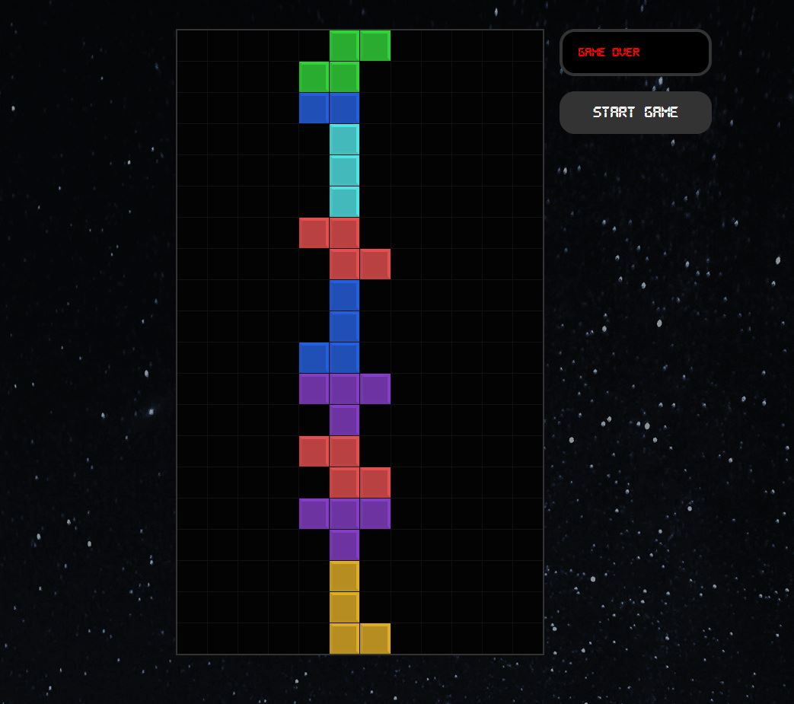

<!-- PROJECT TITE -->
  <h1 align="center">Tetris with React</h1>
  
  <!-- DESCRIPTION -->
  

  A working demo version of the classic tetris game, developed using React.js.

  <!-- DEPLOYED LINK -->
  Live Link: https://saidhadad.github.io/tetris-react/
   
  GitHub repository URL: https://github.com/SaidHadad/tetris-react

  <!-- TABLE OF CONTENTS -->
  

  
Table of Contents

  <ol>
  <li><a href="#about-the-project">About The Project</a></li>
  <li><a href="#built-with">Built With</a></li>
  <li>
    <a href="#getting-started">Getting Started</a>
    <ul>
    <li><a href="#prerequisites">Prerequisites</a></li>
    <li><a href="#installation">Installation</a></li>
    </ul>
    </li>
  <li><a href="#contributing">Contributing</a></li>
  <li><a href="#license">License</a></li>
  <li><a href="#contact">Contact</a></li>
  </ol>
  

  
  
  <!-- ABOUT THE PROJECT -->
  ## About The Project

  I am developing this project to polish my skills with React, my main focus with this project was onto the use of customhooks and regular hooks to
  realize the state management of the game!.
  Sidenote.- This game actually follows vanilla tetris score system so try and see how far you can get! 
   
   
  ToDo.- 
  <ul>
   <li>Add a highscores table</li>
   <li>Add a "next tetromino" function so the user can plan ahead.</li>

  

  ## Built With

  * JavaScript
  * Node.js
  * React.js
  
  <!-- LICENSE -->
  
  ## License

 

[MIT License](https://choosealicense.com/licenses/mit/)  
  
  <!-- CONTACT -->
  
  ## Contact
  Name: Said David Hadad  
  Email: saiddavid.hadad@gmail.com  
  GIT: https://github.com/SaidHadad  